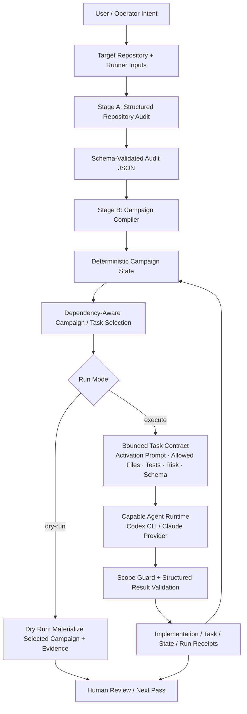
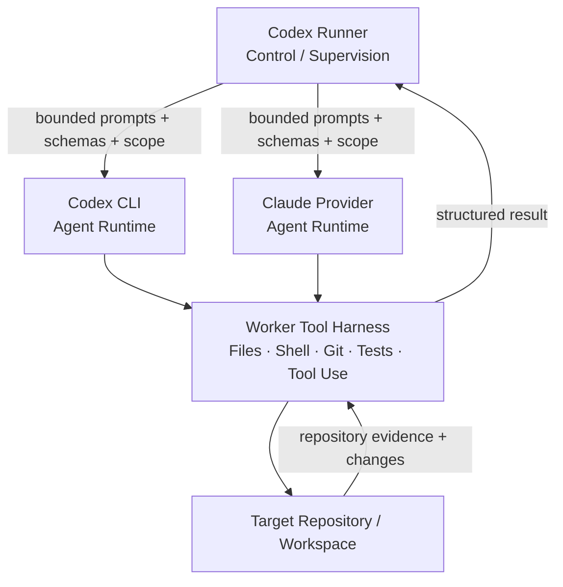
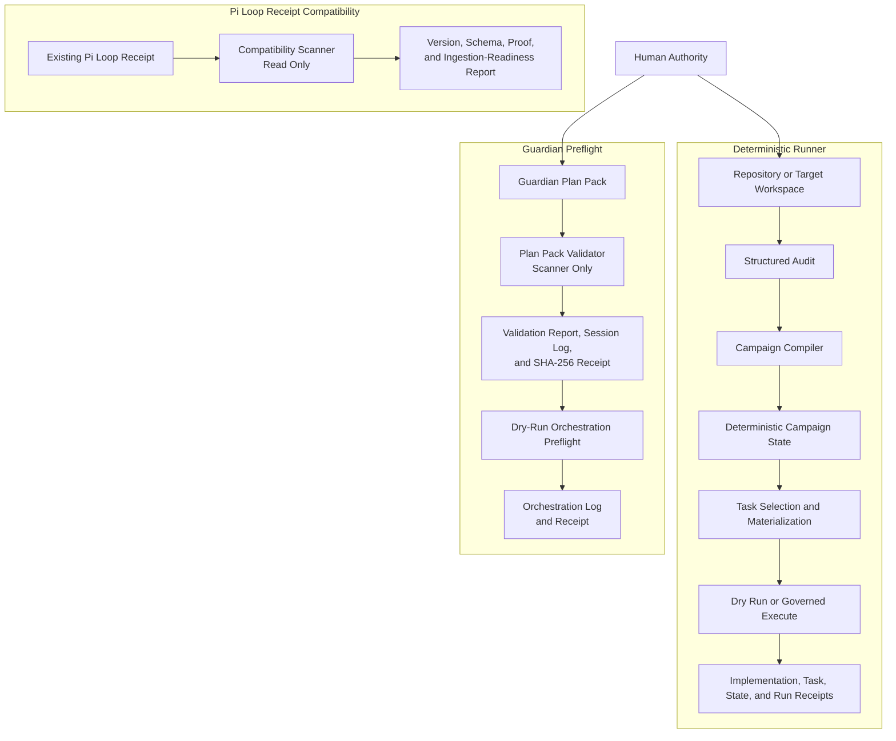
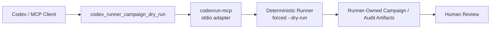

# Codex Runner

Deterministic, receipt-driven orchestration for repository auditing, bounded task execution, Pi Loop diagnostics, and Guardian-governed preflight workflows.

Codex Runner packages a narrow, shareable execution path extracted from a larger internal orchestration system. It keeps planning, execution, evidence, and authority boundaries explicit so that providers such as Codex and Claude remain interchangeable execution engines rather than architectural owners.

> **Status:** Private alpha  
> **Distribution:** Trusted friend-share evaluation package  
> **Python:** 3.11+  
> **Default posture:** Inspect first. Execute deliberately. Preserve receipts.

> **Important:** Codex Runner is orchestration software, not a complete general-purpose agent runtime. It is designed to supervise a capable coding-agent harness such as Codex CLI or the supported Claude CLI path. Do not treat a raw model API endpoint, even a frontier model, as a drop-in worker unless you first provide the file, shell, git, validation, and tool-use harness that the worker needs.

---

## What Codex Runner Is

The shortest useful description is:

> **The agent is an interchangeable worker. Codex Runner owns the orchestration state.**

Codex Runner currently exposes three related but distinct surfaces:

| Surface | Purpose | Current authority |
|---|---|---|
| **Deterministic Runner** | Audit a repository, compile campaigns, select bounded tasks, execute through schema-validated provider interfaces, and write task/run receipts | Dry-run and governed execute mode |
| **Pi Loop Manager v0** | Produce supervised plan-execute-validate run artifacts and scan existing receipts for compatibility and ingestion readiness | Dry-run is the truthful supported mode; included providers remain non-mutating or handoff-oriented |
| **Guardian** | Validate Plan Packs, write evidence receipts, and prepare bounded dry-run orchestration records | Scanner and preflight only; no execution authority |

These surfaces share one doctrine:

- structured inputs before execution
- schema-validated outputs
- explicit provider boundaries
- inspectable artifacts and receipts
- no implied authority from successful validation
- durable or higher-risk actions remain human-governed

### What the deterministic runner contributes

The runner is responsible for the orchestration contract around the worker. In practical terms it supplies and tracks:

- a repository audit stage
- a campaign compiler stage
- deterministic campaign and task state
- dependency-aware task selection
- task activation prompts
- allowed file scope
- listed validation commands
- provider/model selection
- result schemas
- scope enforcement
- implementation and receipt commits in execute mode
- run metadata, traces, and other evidence artifacts

The worker still needs to be an actual coding agent. Codex Runner is not trying to rebuild every capability already provided by Codex CLI, Claude, or another sufficiently capable agent harness.

---

## Current Truth

### Implemented

- Deterministic repository audit and campaign compilation
- Campaign selection, task materialization, scoped execution, and run receipts
- Codex and Claude provider adapters behind the runner boundary
- Experimental stdio MCP adapter for deterministic campaign dry-runs
- Local Codex plugin bundle for the MCP adapter
- Pi Loop Manager v0 dry-run workflow
- Pi Loop receipt compatibility reporting for v0 and v1 receipt envelopes
- Guardian Plan Pack validation
- Guardian validation session logs and SHA-256-backed validation receipts
- Guardian dry-run orchestration preflight
- Guardian orchestration logs and receipts
- Promptnomicon Steward scaffolding for repository-local context management
- Optional Textual TUI behind the `tui` extra

### Supported but bounded

- The current deterministic path requires a clean Git worktree before a pass begins
- Execute mode preserves auto-commit and auditability invariants
- `--no-auto-commit` is intentionally rejected in deterministic mode
- Pi Loop `--execute` is wired through the bounded provider interface, but the included providers are currently non-mutating (`stub`) or handoff-oriented (`manual`)
- Guardian commands may inspect, validate, fingerprint, and prepare evidence
- A passing validator result means the input is structurally readable, not approved
- The MCP surface is deliberately dry-run only

### Proposed, not shipped

- A Codexify Guardian UI and backend bridge for invoking the existing preflight-only Guardian command surface
- Codexify durable ingestion of Pi Loop or Guardian evidence
- Whoosh'd-backed inference
- Provider-neutral offline execution outside the current default CLI path

### Explicitly prohibited from Guardian

Guardian does not:

- invoke Pi Loop
- execute Plan Packs
- mutate source
- touch Codexify durable state
- perform provider execution
- apply patches
- dispatch work
- merge changes
- auto-fill reviewer decisions
- promote trust or authority

The preflight boundary is fixed:

```text
PREFLIGHT ONLY
NO PI LOOP INVOCATION
NO SOURCE MUTATION
NO CODEXIFY INGESTION
```

---

## Architecture

### Deterministic execution loop

This is the core mental model for the main runner:



The plan is therefore not just prose left in the worker's context window. Campaigns and tasks are compiled into structured state, and each task carries an explicit contract that can be inspected independently of the model that executes it.

### Runner versus worker runtime



The current provider boundary is intentionally CLI/agent-oriented. A raw chat-completions-style model endpoint does not automatically provide the worker harness shown above.

### Full repository surface map

The three repository surfaces are siblings under the same authority doctrine. They are not one continuous execution pipeline.



### Boundary summary

```text
Providers execute behind the harness.
The runner owns orchestration state and receipt semantics.
Receipts provide evidence, not authority.
Guardian prepares and reports, but does not execute.
Codexify durable mutation remains outside this repository's default path.
Human approval remains the final authority boundary.
```

For the deterministic Codex provider, an operator may pin one local binary with `--codex-executable /absolute/path/to/codex`. The path must already be an executable regular file; otherwise Runner stops before capability inspection or provider execution. Without the option, Runner keeps the normal `PATH` lookup. The selected binary is shared by capability inspection and every `codex exec` stage. This option is not exposed through the current MCP adapter, Guardian, or Pi Loop authority, and it does not turn receipts into approval.

---

## Quick Start

### 1. Prerequisites

You need:

- Python 3.11+
- Git
- a Git repository to inspect
- a clean target worktree for the current deterministic path
- a supported worker runtime available to the runner (`codex` by default, or the supported Claude provider path)

If you only have access to a raw model API, add a real agent harness first. The runner expects the worker side to be capable of repository inspection and the tool-mediated development work required by the selected provider path.

### 2. Install from a local checkout

From the Codex Runner repository root:

```bash
python3 -m pip install -e .
```

Install with optional TUI support:

```bash
python3 -m pip install -e '.[tui]'
```

Install development dependencies:

```bash
python3 -m pip install -e '.[dev]'
```

The installation exposes two console entry points:

```text
codexrun      # deterministic runner / TUI / subcommand dispatcher
codexrun-mcp  # experimental stdio MCP server
```

### 3. Interactive TUI

With the `tui` extra installed, running `codexrun` with no arguments in an interactive terminal opens the TUI:

```bash
codexrun
```

You can also request it explicitly:

```bash
codexrun --tui
```

The TUI is a convenience layer for constructing the same runner configuration. It does not widen authority or bypass the deterministic execution rules.

### 4. Run the deterministic audit-to-campaign pipeline

The safest first run is a dry-run. From the Codex Runner checkout:

```bash
RUNNER_ROOT="$(pwd)"
TARGET_REPO="/absolute/path/to/target-repo"

codexrun --dry-run \
  --repo-root "$TARGET_REPO" \
  --audit-prompt-file "$RUNNER_ROOT/src/codex_runner/prompts/mega_audit.md" \
  --audit-schema-file "$RUNNER_ROOT/src/codex_runner/schemas/mega_audit_output.schema.json" \
  --compiler-prompt-file "$RUNNER_ROOT/src/codex_runner/prompts/audit_report_to_campaign_runner.md" \
  --campaign-set-schema-file "$RUNNER_ROOT/src/codex_runner/schemas/campaign_set.schema.json" \
  --task-result-schema-file "$RUNNER_ROOT/src/codex_runner/schemas/task_result.schema.json"
```

The module entrypoint maps to the same deterministic runner:

```bash
python -m codex_runner \
  --dry-run \
  --repo-root "$TARGET_REPO" \
  --audit-prompt-file "$RUNNER_ROOT/src/codex_runner/prompts/mega_audit.md" \
  --audit-schema-file "$RUNNER_ROOT/src/codex_runner/schemas/mega_audit_output.schema.json" \
  --compiler-prompt-file "$RUNNER_ROOT/src/codex_runner/prompts/audit_report_to_campaign_runner.md" \
  --campaign-set-schema-file "$RUNNER_ROOT/src/codex_runner/schemas/campaign_set.schema.json"
```

A deterministic dry-run still performs the audit and campaign-compilation stages through the configured provider. What it does **not** do is hand the selected task contract to the task worker for source implementation. Instead, it materializes the selected campaign and evidence for review.

### 5. Choose a provider

Codex is the default provider:

```bash
codexrun ... --provider codex
```

Claude is also supported by the deterministic provider boundary:

```bash
codexrun ... --provider claude
```

You can optionally choose a default model or stage-specific models, for example:

```bash
codexrun ... \
  --provider codex \
  --codex-model <model> \
  --codex-model-audit <audit-model> \
  --codex-model-compiler <compiler-model> \
  --codex-model-task <task-model>
```

### 6. Execute a compiled task

After inspecting dry-run output, governed execute mode uses the same inputs with `--execute`:

```bash
codexrun --execute \
  --repo-root "$TARGET_REPO" \
  --audit-prompt-file "$RUNNER_ROOT/src/codex_runner/prompts/mega_audit.md" \
  --audit-schema-file "$RUNNER_ROOT/src/codex_runner/schemas/mega_audit_output.schema.json" \
  --compiler-prompt-file "$RUNNER_ROOT/src/codex_runner/prompts/audit_report_to_campaign_runner.md" \
  --campaign-set-schema-file "$RUNNER_ROOT/src/codex_runner/schemas/campaign_set.schema.json" \
  --task-result-schema-file "$RUNNER_ROOT/src/codex_runner/schemas/task_result.schema.json"
```

Execute mode is intentionally opinionated:

- the worktree must be clean before the pass begins
- campaign branching is enabled by default
- deterministic mode requires auto-commit so the repository returns to a clean, inspectable state between transitions
- task output is schema-validated
- file-scope enforcement runs after the worker returns
- implementation and receipt evidence is committed separately

Use execution only after you understand the generated campaign/task contract and are comfortable with the configured provider operating on the target repository.

---

## MCP: Experimental Dry-Run Transport

Codex Runner includes a local stdio MCP server. The MCP surface is intentionally much narrower than the CLI.

### What is exposed

The server command is:

```text
codexrun-mcp
```

It currently exposes exactly one tool:

```text
codex_runner_campaign_dry_run
```

That tool validates its arguments and invokes the deterministic runner in forced `--dry-run` mode. It does **not** expose Pi Loop, Guardian operations, arbitrary shell execution, source-edit authority, approval, or durable Codexify mutation.

### MCP architecture



### Option A: use the included Codex plugin bundle

The repository includes:

```text
plugins/codex-runner/
├── .codex-plugin/plugin.json
├── .mcp.json
└── skills/codex-runner-delegation/SKILL.md
```

The bundle's MCP configuration launches `codexrun-mcp`. Install the Python package first so that command exists on `PATH`, then register the `plugins/codex-runner/` bundle with the local plugin/marketplace mechanism supported by your Codex installation.

The repository does not modify a user's Codex marketplace or plugin configuration automatically.

### Option B: register the MCP server directly

For an MCP client that accepts stdio server configuration, the equivalent server entry is:

```json
{
  "mcpServers": {
    "codex-runner": {
      "command": "codexrun-mcp"
    }
  }
}
```

If the client does not inherit the same Python environment, use an absolute path to the installed `codexrun-mcp` executable instead of relying on `PATH`.

### Required MCP tool arguments

`codex_runner_campaign_dry_run` requires:

- `repo_root`
- `audit_prompt_file`
- `audit_schema_file`
- `compiler_prompt_file`
- `campaign_set_schema_file`

Optional arguments include provider choice, task result schema, pass count, base ref, provider model selection, provider configuration/settings, branch behavior, verification, discovery fallback, and debug mode.

A representative tool payload is:

```json
{
  "repo_root": "/absolute/path/to/target-repo",
  "audit_prompt_file": "/absolute/path/to/Codex-Runner/src/codex_runner/prompts/mega_audit.md",
  "audit_schema_file": "/absolute/path/to/Codex-Runner/src/codex_runner/schemas/mega_audit_output.schema.json",
  "compiler_prompt_file": "/absolute/path/to/Codex-Runner/src/codex_runner/prompts/audit_report_to_campaign_runner.md",
  "campaign_set_schema_file": "/absolute/path/to/Codex-Runner/src/codex_runner/schemas/campaign_set.schema.json",
  "task_result_schema_file": "/absolute/path/to/Codex-Runner/src/codex_runner/schemas/task_result.schema.json",
  "provider": "codex",
  "passes": 1
}
```

The MCP adapter returns process classification/output plus references to Runner-generated artifacts. Treat those references as evidence to inspect, not as proof that implementation occurred or that execution is authorized.

### Example request from an MCP-capable agent

A natural-language request can be as simple as:

```text
Run a Codex Runner campaign dry-run for /absolute/path/to/target-repo using the
bundled audit prompt, audit schema, campaign compiler prompt, and campaign-set
schema from this Codex Runner checkout. Use the Codex provider and show me the
Runner-generated artifacts for review.
```

The installed delegation skill is intentionally scoped so that this request maps only to the dry-run campaign tool.

### MCP limitations by design

The MCP adapter does not expose:

- `--execute`
- `--codex-executable`
- Pi Loop invocation
- Guardian invocation
- direct source mutation authority
- approval or merge authority
- Codexify ingestion authority

The adapter is transport. The runner remains the owner of orchestration semantics and generated evidence.

---

## Pi Loop Manager v0

Dry-run usage:

```bash
codexrun loop \
  --task examples/example-loop-task.yaml \
  --repo-root /path/to/repo \
  --dry-run
```

Module entrypoint:

```bash
python -m codex_runner.loop_manager \
  --task examples/example-loop-task.yaml \
  --repo-root /path/to/repo \
  --dry-run
```

Pi Loop run artifacts are written under:

```text
.pi/runs/<run_id>/
```

Current v0 posture:

- `--dry-run` is the truthful supported mode
- `--execute` uses the same bounded provider interface
- included providers remain non-mutating (`stub`) or handoff-oriented (`manual`)
- durable Codexify ingestion remains deferred

### Scan a Pi Loop receipt

Human-readable compatibility report:

```bash
codexrun loop report \
  --receipt tests/fixtures/loop_receipt_v0.json
```

Machine-readable JSON report:

```bash
codexrun loop report \
  --receipt tests/fixtures/loop_receipt_v0.json \
  --json
```

Module entrypoint:

```bash
python -m codex_runner.loop_manager report \
  --receipt tests/fixtures/loop_receipt_v1.json \
  --json
```

The report is a scanner, not a gate. It never ingests, mutates, approves, dispatches, or merges.

The report always emits the following as `false`:

- `lifecycle_mutation_allowed`
- `ingestion_allowed`
- `durable_action_allowed`
- `ingestion_performed`

`codexify_ingestion_readiness` is:

- `blocked` for v0 receipts
- `blocked` for incomplete v1 envelopes
- `candidate` only for a complete v1 proof envelope pending governed operator review

---

## Guardian Preflight

### Validate a Guardian Plan Pack

Validate the included golden sample:

```bash
codexrun guardian validate-plan-pack \
  --path docs/guardian/examples/sample-dry-run-plan-pack/
```

Return machine-readable JSON:

```bash
codexrun guardian validate-plan-pack \
  --path docs/guardian/examples/sample-dry-run-plan-pack/ \
  --json
```

Write a validation receipt:

```bash
codexrun guardian validate-plan-pack \
  --path docs/guardian/examples/sample-dry-run-plan-pack/ \
  --write-receipt
```

Module entrypoint:

```bash
python3 -m codex_runner.runner guardian validate-plan-pack \
  --path docs/guardian/examples/sample-dry-run-plan-pack/ \
  --json
```

Exit codes:

- `0`: the Plan Pack passes structural validation
- `1`: the Plan Pack fails structural validation

A `0` exit is not approval and does not grant execution permission.

### Run Guardian dry-run orchestration preflight

```bash
codexrun guardian orchestrate-dry-run \
  --plan-pack docs/guardian/examples/sample-dry-run-plan-pack/
```

Write local orchestration evidence:

```bash
codexrun guardian orchestrate-dry-run \
  --plan-pack docs/guardian/examples/sample-dry-run-plan-pack/ \
  --write-orchestration-log \
  --write-orchestration-receipt
```

This command prepares evidence only. It does not invoke Pi Loop, execute a provider, mutate source, or touch Codexify.

---

## Generated Artifacts

| Surface | Default artifact locations |
|---|---|
| Deterministic Runner | `docs/_audits/`, `docs/Campaign/`, `docs/tasks/`, `docs/_campaign_runs/` |
| Pi Loop Manager | `.pi/runs/<run_id>/` |
| Guardian validator | `.guardian/sessions/`, `.guardian/receipts/` |
| Guardian orchestration preflight | `.guardian/orchestrations/`, `.guardian/orchestration-receipts/` |

Generated artifacts are evidence and diagnostics. They do not independently grant approval, execution authority, ingestion permission, or trust promotion.

---

## Provider Boundary

Codex Runner currently supports Codex and Claude provider adapters for the deterministic runner.

Providers receive:

- rendered stage or task prompts
- explicit repository and campaign context
- schema requirements
- allowed file scope
- listed validation commands
- bounded execution constraints

Providers do not own:

- campaign state
- authority policy
- receipt semantics
- repository identity
- durable Codexify state
- approval decisions

The harness owns the orchestration contract. Providers remain replaceable.

---

## Guardian Authority Model

Guardian is layered on top of the Codex Runner diagnostic spine.

The current authority model separates three levels:

1. **Guardian operating authority**  
   Read Plan Packs, run scanners, prepare dry-run orchestration records, and surface escalation flags.

2. **Human operating authority**  
   Approve execution, resolve escalations, and supply reviewer decisions.

3. **Human Codexify authority**  
   Approve ingestion, WorkOrder or Execution Ledger mutation, and all durable actions.

The third level is never delegated to Guardian.

For the full contract, begin with [`docs/guardian/README.md`](docs/guardian/README.md).

---

## Documentation Map

### Core repository documents

- [`SAFETY.md`](SAFETY.md): safety posture and execution boundaries
- [`CHANGELOG.md`](CHANGELOG.md): package history
- [`EVALUATION-LICENSE.md`](EVALUATION-LICENSE.md): private-alpha evaluation terms

### Pi Loop and diagnostic spine

- [`docs/specs/campaign-runner/PI_LOOP_DIAGNOSTIC_SPINE_REVIEW_PACKET.md`](docs/specs/campaign-runner/PI_LOOP_DIAGNOSTIC_SPINE_REVIEW_PACKET.md)
- [`docs/specs/campaign-runner/PI_LOOP_RECEIPT_REPORT_OPERATOR_RUNBOOK.md`](docs/specs/campaign-runner/PI_LOOP_RECEIPT_REPORT_OPERATOR_RUNBOOK.md)
- [`docs/specs/campaign-runner/PI_LOOP_RECEIPT_SCHEMA_V1_PROPOSAL.md`](docs/specs/campaign-runner/PI_LOOP_RECEIPT_SCHEMA_V1_PROPOSAL.md)
- [`docs/specs/campaign-runner/PI_LOOP_RECEIPT_COMPATIBILITY_AUDIT.md`](docs/specs/campaign-runner/PI_LOOP_RECEIPT_COMPATIBILITY_AUDIT.md)

### Guardian

- [`docs/guardian/README.md`](docs/guardian/README.md): Guardian surface map and reading order
- [`docs/guardian/GUARDIAN_OPERATING_CONTRACT_V0.md`](docs/guardian/GUARDIAN_OPERATING_CONTRACT_V0.md)
- [`docs/guardian/GUARDIAN_OPERATIONAL_CONTRACT_ADDENDUM_V0.md`](docs/guardian/GUARDIAN_OPERATIONAL_CONTRACT_ADDENDUM_V0.md)
- [`docs/guardian/GUARDIAN_PLAN_PACK_VALIDATOR_OPERATOR_RUNBOOK.md`](docs/guardian/GUARDIAN_PLAN_PACK_VALIDATOR_OPERATOR_RUNBOOK.md)
- [`docs/guardian/GUARDIAN_UI_COMMAND_SURFACE_CONTRACT_V0.md`](docs/guardian/GUARDIAN_UI_COMMAND_SURFACE_CONTRACT_V0.md)
- [`docs/guardian/templates/`](docs/guardian/templates/)
- [`docs/guardian/examples/sample-dry-run-plan-pack/`](docs/guardian/examples/sample-dry-run-plan-pack/)

### Context management

Promptnomicon Steward scaffolding lives under `.promptnomicon/`:

- [`.promptnomicon/promptnomicon-steward.md`](.promptnomicon/promptnomicon-steward.md)
- [`.promptnomicon/promptnomicon-steward-session.md`](.promptnomicon/promptnomicon-steward-session.md)
- [`.promptnomicon/project-reality-footer.md`](.promptnomicon/project-reality-footer.md)

Start a repository-local stewardship pass with `.promptnomicon/promptnomicon-steward-session.md` when you need current-state analysis, bounded next steps, and a receipt-shaped session output.

---

## Build a Local Wheel

Build the distribution:

```bash
python3 -m build
```

Install the wheel:

```bash
python3 -m pip install --force-reinstall dist/*.whl
```

The packaged wheel includes bundled prompts, templates, and JSON schemas under the `codex_runner` package path.

When working from an installed wheel rather than a repository checkout, point prompt and schema arguments at the installed package files under:

```text
site-packages/codex_runner/
```

---

## Development

Run the test suite:

```bash
pytest -q
```

The project package metadata is defined in `pyproject.toml`.

Current package name:

```text
codex-runner-friend-share
```

Current package version:

```text
0.1.0a0
```

This repository is not intended for public PyPI distribution.

---

## License and Distribution

Codex Runner is a private-alpha evaluation package, not public open source.

The included [`EVALUATION-LICENSE.md`](EVALUATION-LICENSE.md) permits private evaluation, inspection, installation, execution, and local backups.

It prohibits:

- redistribution
- sublicensing
- resale
- hosting the software as a service
- public publication
- removal or alteration of attribution and license notices

No rights beyond private evaluation are granted unless a separate written agreement says otherwise.

Because this repository may be visible while remaining source-available only under restrictive evaluation terms, visibility must not be interpreted as an open-source grant.

---

## Design Intent

This repository is intentionally constrained.

- It exposes a narrow execution path without publishing adjacent internal systems
- It separates orchestration, identity, execution, and durable authority
- It prefers deterministic planning and receipt-backed evidence
- It treats dry-run inspection as the recommended starting point
- It keeps experimental provider-neutral, offline, and Codexify-ingestion work outside the default CLI path
- It preserves human authority at every category boundary

Codex Runner is currently a private-alpha friend-share package. Interfaces, execution semantics, packaging strategy, and licensing terms may change as the system evolves.

---

## Project Links

- Website: [ResonantConstructs.ai](https://ResonantConstructs.ai)
- Codexify: [Codexify.Space](https://Codexify.Space)
- Community: [r/ResonantConstructs](https://reddit.com/r/ResonantConstructs)
- Discord: [Resonant Constructs](https://discord.gg/C6AvyWpd)
